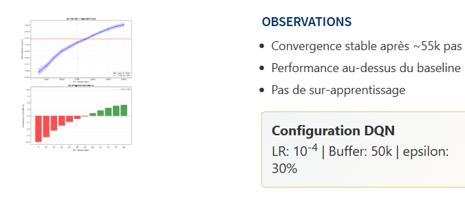
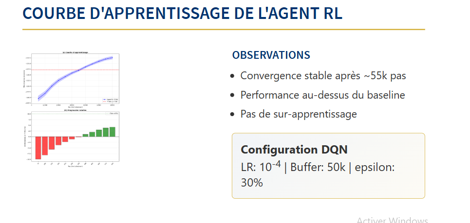

## Slide 1 : Jumeau Numérique pour le Trafic Ouest-Africain

Merci Monsieur le Président du Jury de m'avoir donné la parole.

Excellence Monsieur le Président du Jury, honorables membres du Jury, chers parents, amis et invités, bonjour.

Je suis Elonm AHOUANYE, et j'ai le plaisir de vous présenter aujourd'hui notre travail de fin de formation d'Ingénieur de Conception en Informatique, Logistique et Recherche Opérationnelle.

Ce travail porte sur la conception d'un "Jumeau Numérique pour le Trafic Ouest-Africain", et son utilisation pour optimiser les feux de signalisation grâce à l'Intelligence Artificielle.

Il a été réalisé sous la supervision du Dr. Abel KONNON et l'encadrement du Dr. Ing. Regis Donald HONTINFINDE, que je tiens à remercier pour leur suivi rigoureux tout au long de ce projet.

---

## Slide 2 : Plan de la Présentation

Pour cette présentation, nous suivrons une démarche classique.

Nous commencerons par le contexte et une revue de la littérature, pour comprendre pourquoi les solutions actuelles ne suffisent pas.

Ensuite, la méthodologie indiquant comment nous avons construit ce simulateur.

Les résultats, pour voir si l'IA apporte vraiment un gain.

Et enfin, les perspectives que ce travail ouvre pour nos villes.

---

## Slide 3 : Contexte Ouest-Africain

Les embouteillages. Nous les connaissons tous. Cette frustration de perdre un temps précieux, coincé dans un go slow.

Chaque matin, des millions de personnes en Afrique de l'Ouest vivent cette réalité.

À Lagos, la plus grande ville d'Afrique, les habitants perdent en moyenne **2 heures 21 minutes PAR JOUR** dans les bouchons.
Pas par semaine. PAR JOUR.

Sur une année de travail, cela représente plus de **600 heures**.
Soit **près d'un mois complet** passé... à attendre.

Le coût ? **4,8 milliards de dollars** perdus chaque année.
Près de **2 900 milliards de francs CFA**.
Pour une seule ville.

Et la pollution aux carrefours ? À Cotonou, une étude scientifique de l'Université d'Abomey-Calavi a mesuré **181 microgrammes par mètre cube de PM2.5** dans les zones à fort trafic, soit **36 fois la norme recommandée par l'OMS**.

Ce problème, à la fois environnemental, sanitaire et économique, a motivé notre travail.

---

## Slide 4 : Le Défi du Trafic Ouest-Africain

Ce qui rend notre trafic unique, c'est sa composition.

Selon les études de la Banque Mondiale et du programme SSATP, plus de **70% des déplacements urbains** dans des villes comme Cotonou, Douala ou Lomé se font en **motos**.

Ces conducteurs ont des comportements très différents des voitures : ils remplissent chaque espace libre entre les véhicules — c'est le *gap-filling* —, et ils changent de file en permanence — c'est l'*interweaving*.

Cette hétérogénéité rend le trafic imprévisible et difficile à modéliser avec les outils classiques conçus pour des flux homogènes de voitures.

---

## Slide 5 : Pourquoi les Solutions Classiques Échouent

Nos systèmes de gestion actuels ne sont pas adaptés à cette réalité.

Les feux tricolores fonctionnent à temps fixe.
30 secondes au vert, 30 secondes au rouge, peu importe qu'il y ait 10 voitures ou 500 motos.
Ces feux ne voient pas le trafic.

De plus, les modèles de simulation existants ont été conçus pour des flux de voitures homogènes et ne représentent pas notre réalité motos-voitures.

---

## Slide 6 : Questions et Objectifs de Recherche

L'objectif de ce mémoire était donc de combler ce double gap, technologique et scientifique.

Nous nous sommes posé trois questions simples :

1. Peut-on modéliser mathématiquement ce trafic mixte ?
2. Peut-on le simuler de manière réaliste sans avoir des capteurs partout ?
3. Une agent intelligent peut-il mieux faire qu'un feu tricolore classique dans ce contexte ?

Notre réponse : le modèle ARZ pour la physique, l'apprentissage par renforcement pour le contrôle.

---

## Slide 7 : Évolution des Modèles de Trafic

Notre approche repose sur des fondations solides, que nous avons adaptées à notre contexte.

Les modèles de trafic ont évolué depuis 1955. On est passé du modèle LWR — qui traite le trafic comme l'eau dans un tuyau — au modèle ARZ, développé par **Aw et Rascle en 2000**, puis étendu par **Zhang**, qui prend en compte l'inertie des conducteurs.

Récemment, des modèles multi-classes sont apparus.

Notre travail a donc consisté à étendre ces modèles pour capturer les interactions spécifiques de notre trafic ouest-africain.

---

## Slide 8 : Gap Scientifique Identifié

C'est ici que se situe notre apport scientifique.

Les modèles classiques sont trop simples pour nous.

Les gros simulateurs commerciaux (comme SUMO ou CityFlow) sont des boîtes noires difficiles à calibrer pour nos réalités.

Nous proposons alors : un modèle mathématique rigoureux, mais adapté localement et conçu dès le départ pour être piloté par une IA.

---

## Slide 9 : Architecture Globale du Système

Excellence Monsieur le Président du Jury, honorables membres du Jury,
permettez-moi maintenant de vous présenter notre méthodologie.

Voici l'architecture du système que nous avons développé.

Le **Modèle Physique ARZ** décrit le mouvement du trafic par des équations.

Le **Solveur Numérique** calcule l'évolution du trafic pas à pas.

L'**Agent Deep Q Network** informé des données du trafic par la simulation contrôle les feux de manière intelligente.

Ces trois blocs ensemble constituent notre Jumeau Numérique.

---

## Slide 10 : Modèle ARZ Multi-Classes

Commençons par le cœur du système : le modèle physique.

Le modèle ARZ multi-classes repose sur deux équations pour chaque classe de véhicules, motos et voitures.

La première, la **conservation de la masse** : les véhicules ne disparaissent pas, ils s'écoulent d'un point à un autre. Plus la densité augmente, plus la vitesse diminue.

La deuxième, la **dynamique de la vitesse** : les conducteurs ajustent constamment leur vitesse vers un équilibre qui dépend de la densité autour d'eux. Pas de vitesse fixe. Une adaptation permanente.

Maintenant, comment résoudre ces équations numériquement ?

---

## Slide 11 : Discrétisation Spatiale : Volumes Finis

Pour résoudre ces équations, nous utilisons la Méthode des **Volumes Finis**.

On découpe la route en cellules. Chaque cellule stocke un vecteur d'état moyen : densité et quantité de mouvement.

Les Volumes Finis font intervenir une variable F, le **flux numérique** grand F.

Tout le défi est là : pour calculer l'état du trafic à l'instant suivant U(i+1), on a besoin de connaître le flux aux frontières symbolisé par F i + 1 demi(1/2).

Mais comme on ne stocke que des moyennes Ui, la valeur exacte à l'interface (i+ 1/2) est inconnue. Il faut donc la **reconstruire**.

---

## Slide 12 : Haute Précision : Schéma WENO5

C'est ici qu'intervient la reconstruction.

Si on utilise une méthode simple (ordre 1), on **diffuse** l'information.
Observez la courbe bleue : un bouchon qui devrait être un "mur" net devient une colline étalée.
C'est physiquement faux.

D'où notre choix : la reconstruction **WENO5** (ordre 5).
Le principe est astucieux, au lieu d'utiliser une seule cellule, on fait une moyenne pondérée sur plusieurs cellules comme le décrit l'équation à gauche.

Résultat : la courbe rouge reste **nette**.
Cette précision est cruciale pour que l'IA puisse "voir" les bouchons exactement là où ils sont.

---

## Slide 13 : Du Simulateur à l'Environnement d'Apprentissage

Nous avons maintenant un simulateur complet et précis. Le modèle ARZ capture la physique, le solveur préserve les discontinuités.

Mais ce simulateur reste **passif**. Il peut simuler le trafic, mais il ne peut pas l'optimiser.

C'est là qu'intervient la transformation cruciale : nous allons **encapsuler** ce simulateur dans un environnement d'apprentissage par renforcement, conforme à l'API standard Gymnasium.

C'est le cœur de notre approche : utiliser la simulation pour entraîner une IA qui pourra ensuite être déployée dans le monde réel.

---

## Slide 14 : Environnement RL - API Gymnasium

Pour l'IA, nous avons utilisé l'agent DQN (Deep Q-Network) une méthode d'apprentissage par renforcement développé par Google DeepMind en 2015.

L'agent DQN est comme un policier au carrefour. Il regarde l'état du trafic (densités, vitesses).

Il prend une action : laisser vert ou passer au rouge.

Et il reçoit une récompense : plus le trafic coule, plus il gagne de points. Il apprend ainsi suite à ses échecs à maximiser la fluidité globale.

---

## Slide 15 : Validation H1 : Tests de Riemann

Excellence Monsieur le Président du Jury, honorables membres du Jury,
passons maintenant aux résultats.

D'abord, la validation mathématique.

Nous avons soumis le modèle à des tests standards (les problèmes de Riemann).

Comme vous le voyez, le modèle gère parfaitement les ondes de choc et de détente. Il n'y a pas d'aberration numérique. Le moteur est fiable.

---

## Slide 16 : Validation H2 : Dynamique du Réseau

La théorie fonctionne. Mais le modèle peut-il reproduire un vrai trafic de ville ?

C'est l'objet de la validation H2.

Ces instantanés produites en représentant le réseau routier en forme de graphe montrent l'évolution temporelle du trafic sur le corridor de Victoria Island.

On observe clairement la propagation des ondes de choc (zones rouges) qui remontent le courant.

Le modèle reproduit les trois régimes de trafic : fluide, congestionné, et bouchonné.

Cela confirme que notre jumeau numérique reproduit correctement le trafic.

Pour mieux visualiser cette dynamique, voici une démonstration interactive.

---

## Slide 17 : Démonstration Jumeau Numérique

Voici maintenant une démonstration interactive de ce corridor.

Nous nous sommes entraînés sur Victoria Island à Lagos, la plus grande ville d'Afrique et l'une des plus congestionnées d'Afrique de l'Ouest.

Ce que vous voyez ici, c'est notre jumeau numérique en action :

- Les **traînées orange** représentent les motos, qui constituent 70% du flux.
- Les **traînées bleues** représentent les voitures.
- Les **colonnes 3D** aux intersections sont les feux de signalisation.

Observez comment le trafic ralentit aux intersections et comment les ondes de densité se propagent vers l'amont. C'est cette dynamique que notre agent RL apprend à optimiser.

---

## Slide 18 : Courbe d'Apprentissage de l'Agent RL

**Monsieur le Président, honorables membres du Jury**, maintenant que nous avons validé l'outil de simulation, voyons ce que l'agent DQN a réussi à faire.

Voici la courbe d'apprentissage de l'agent.

Au début, il tâtonne. Mais après environ 50 000 itérations, il converge vers une stratégie stable. Il a appris à gérer le carrefour.

---

## Slide 19 : Résultats Comparatifs

Passons aux chiffres.

Nous avons comparé l'agent DQN à un feu à temps fixe bien réglé (méthode Webster).

En moyenne, l'agent DQN améliore le flux de 4.2%.

Mais surtout, en situation de saturation (quand c'est la crise), le gain monte à près de 6%.

Pour un Lagosien qui se déplace 5 jours sur 7, cela représente environ 25 heures récupérées par an. Sur les 600 heures perdues annuellement, c'est un premier pas concret.

---

## Slide 20 : Synthèse des Résultats

Excellence Monsieur le Président du Jury, honorables membres du Jury,
permettez-moi de synthétiser nos résultats.

Nous avons validé le modèle mathématique (H1).

Nous avons validé le réalisme du trafic simulé (H2).

Et nous avons montré que l'agent DQN apporte un gain opérationnel, même s'il reste perfectible (H3).

Les travaux similaires dans la littérature obtiennent généralement des gains de 10 à 20%. Notre résultat de 4.2% montre qu'il y a encore une marge de progression — mais la plateforme est là, fonctionnelle, et prête pour des améliorations futures.

---

## Slide 21 : Contributions

Excellence Monsieur le Président du Jury, honorables membres du Jury,
pour conclure, ce travail apporte trois contributions majeures :

1. Un modèle mathématique adapté à notre contexte (motos/voitures).
2. Une implémentation numérique performante et stable.
3. Une plateforme prête à l'emploi pour entraîner d'autres IA sur nos problématiques locales.

Cela dit, ce travail a ses limites, que nous assumons.

---

## Slide 22 : Limites et Perspectives

Ce travail a ses limites.

La principale : le manque de données réelles pour calibrer finement les paramètres.

Mais les perspectives sont là : tester d'autres algorithmes d'IA, étendre la simulation à tout un quartier, et à terme, connecter de vrais capteurs.

Laissez-moi vous montrer cet avenir.

---

## Slide 23 : Perspective : Le Jumeau Numérique de Demain

Imaginez un lundi matin, 7h, au carrefour IITA à Abomey-Calavi.

C'est l'heure de pointe. Des centaines de motos et de voitures convergent depuis Tankpè vers Cotonou, tandis que d'autres remontent vers l'Étoile Rouge.

Aujourd'hui, un policier fait ce qu'il peut, avec son sifflet et son intuition. Il ne sait pas ce qui arrive depuis Tankpè, il ne peut pas anticiper.

Imaginez maintenant notre système, déployé sur tous les feux du réseau. Le feu au carrefour IITA *sait* qu'une vague de trafic arrive de Tankpè. Il *sait* aussi que le flux vers l'Étoile Rouge est en train de se saturer. Et il décide : « Je vais retenir le flux Nord 15 secondes de plus pour laisser passer la vague Est. »

Un jumeau numérique complet voit, comprend, et agit en temps réel.

Ce que nous avons construit aujourd'hui, c'est le **cerveau** de ce système. Le moteur de décision, la physique du trafic, l'intelligence artificielle.

Ce qui manque ? Des capteurs, des données massives pour affiner les paramètres, et une communauté de chercheurs et d'ingénieurs locaux pour porter ce projet.

Mais la fondation est là. Elle est solide. Et elle est prête à être connectée au monde réel.

---

## Slide 24 : Merci

Pour conclure, ce mémoire est une première pierre vers un avenir où les 2h21 quotidiennes perdues dans les go slow ne seront plus une fatalité, mais un problème résolu par l'intelligence artificielle africaine.

Il démontre qu'il est possible de construire ici, en Afrique, des solutions technologiques de pointe qui répondent précisément à nos propres défis, au lieu de simplement importer des modèles qui ne nous correspondent pas.

C'est la preuve qu'une ingénierie locale et ambitieuse est non seulement possible, mais nécessaire.

Nous vous remercions de votre attention et sommes maintenant à votre disposition pour répondre à vos questions.

---

